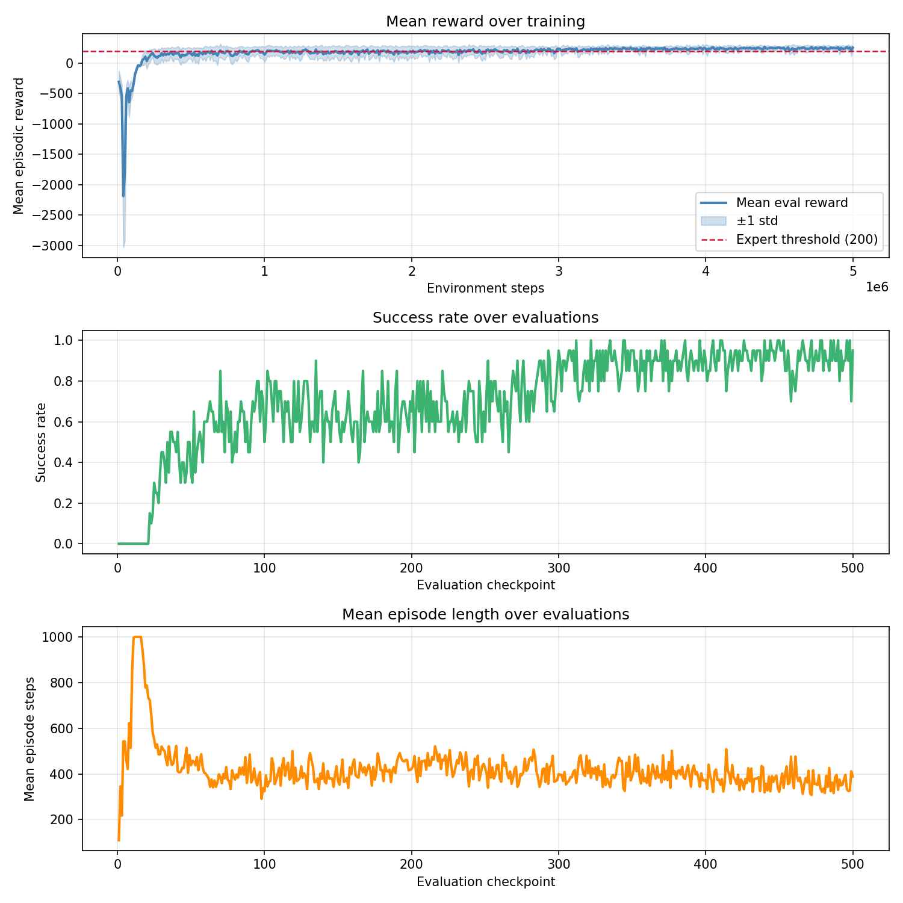
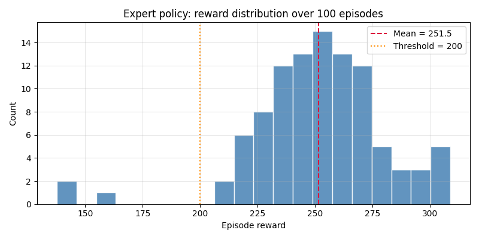
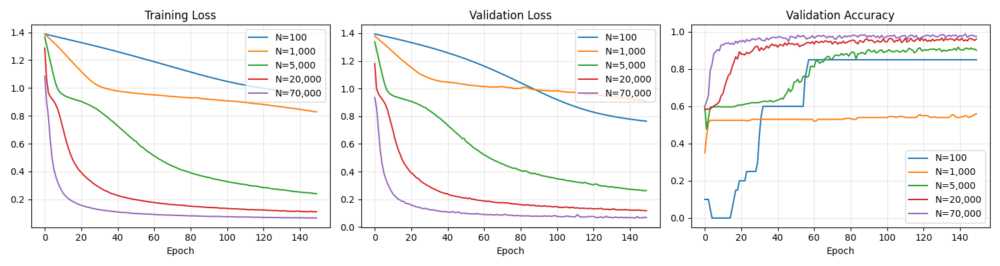
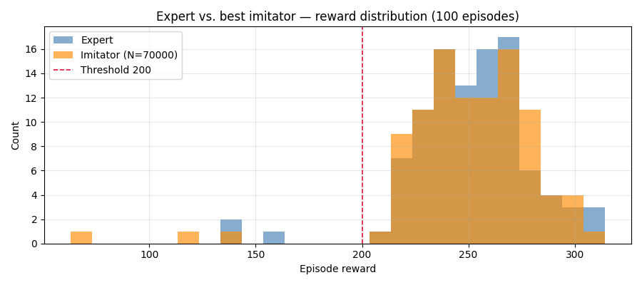
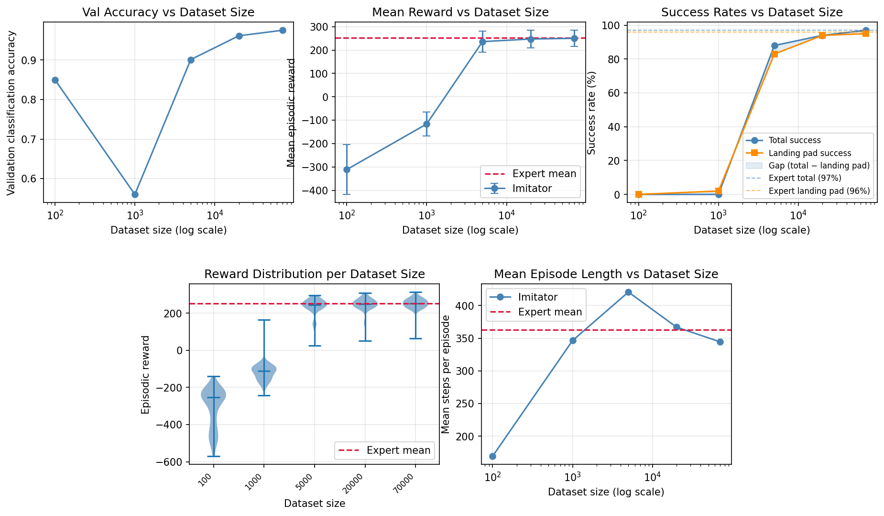
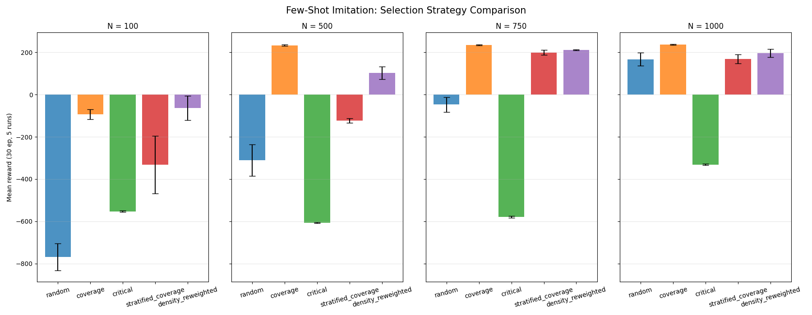

# 🚀 Imitation Learning on LunarLander-v3


**Authors:** Gilad Ticher (318770039) & Tal Hibner (026548446)  
**Course:** Reinforcement Learning, Reichman University — Assignment 1

> Training a PPO expert on `LunarLander-v3`, collecting demonstrations, and distilling expert behaviour into a lightweight neural network via **Behaviour Cloning** — with systematic data-scaling and selection-strategy experiments.

📓 [Open in Google Colab](https://colab.research.google.com/drive/1ckW3NfiaD-HU2vy-1Mc2CETAraHvBCnx?usp=sharing) · 📄 [Full Report (PDF)](report_026548446_318770039.pdf)

---

## Table of Contents

- [Overview](#overview)
- [Environment](#environment)
- [Project Structure](#project-structure)
- [Methodology](#methodology)
  - [Part A — Expert Training (PPO)](#part-a--expert-training-ppo)
  - [Part B — Behaviour Cloning](#part-b--behaviour-cloning)
- [Architecture](#architecture)
- [Hyperparameters](#hyperparameters)
- [Results](#results)
- [Dataset Scaling](#dataset-scaling)
- [Data Selection Strategies](#data-selection-strategies)
- [Setup & Execution](#setup--execution)
- [Dependencies](#dependencies)
- [References](#references)

---

## Overview

This assignment is split into two parts:

| Part | Goal | Method |
|---|---|---|
| **A** | Train a high-quality expert policy | PPO (Proximal Policy Optimization) via Stable-Baselines3 |
| **B** | Replicate expert behaviour without environment interaction | Behaviour Cloning (supervised classification) |

The core question explored in Part B: **how much expert data is needed to achieve expert-level performance?**

---

## Environment

**`LunarLander-v3`** (Gymnasium, Box2D physics)

| Property | Value |
|---|---|
| Observation space | `Box(8,)` — position, velocity, angle, angular velocity, leg contacts |
| Action space | `Discrete(4)` — do nothing, fire left, fire main, fire right |
| Episode termination | Landing/crash, or flying off-screen |
| Success threshold | Mean reward ≥ **200** over 100 episodes |

---

## Project Structure

```
reinforcement-learning-imitation-learning-Assignment1/
│
├── assignment1.ipynb                   # ← All code: training, cloning, evaluation
├── report_026548446_318770039.pdf      # Final report with analysis and figures
│
├── data/
│   ├── demos_full.npz                  # Full 200-episode expert pool (~70k transitions)
│   ├── demos_100.npz                   # 100-sample sub-dataset
│   ├── demos_1000.npz                  # 1k-sample sub-dataset
│   ├── demos_5000.npz                  # 5k-sample sub-dataset
│   ├── demos_20000.npz                 # 20k-sample sub-dataset
│   └── demos_70000.npz                 # 70k-sample sub-dataset
│
├── models/
│   ├── 5m/best_model.zip               # Expert PPO checkpoint (5M timesteps)
│   ├── imitator_100.pt                 # ImitationNet trained on 100 samples
│   ├── imitator_500.pt
│   ├── imitator_1000.pt
│   ├── imitator_5000.pt
│   ├── imitator_10000.pt
│   ├── imitator_20000.pt
│   ├── imitator_50000.pt
│   ├── imitator_70000.pt
│   └── imitator_80000.pt
│
├── logs/
│   └── videos/                         # Recorded episode rollouts
│
└── pyproject.toml                      # Dependencies (managed with uv)
```

---

## Methodology

### Part A — Expert Training (PPO)

A PPO agent is trained from scratch using Stable-Baselines3 with 4 parallel environments. An `EvalCallback` monitors performance every 10,000 steps and saves the best checkpoint.

**Training pipeline:**
```
4 parallel LunarLander-v3 envs
         ↓
  PPO (SB3 defaults)
         ↓
  EvalCallback (every 10k steps, 100 eval episodes)
         ↓
  models/5m/best_model.zip  ← kept only if mean reward ≥ 200
```

### Part B — Behaviour Cloning

Behaviour cloning frames imitation as **supervised multi-class classification**: given a state, predict the action the expert would take.

**Full pipeline:**

```
Expert rollout (200 episodes, ~70k transitions)
         ↓
  data/demos_full.npz  (states, actions)
         ↓
  Sub-sample into N-sized datasets  →  data/demos_{N}.npz
         ↓
  Train ImitationNet per dataset size
         ↓
  Evaluate: run ImitationNet as greedy policy (argmax logits)
         ↓
  Compare dataset sizes (B4) and data-selection strategies (B5)
```

---

## Architecture

### ImitationNet — 3-layer MLP

```
Input (8,)
   ↓  Linear(8 → 64) + ReLU
   ↓  Linear(64 → 64) + ReLU
   ↓  Linear(64 → 4)       ← raw logits
Output (4,)
```

- **Loss:** Cross-entropy (action classification)
- **Optimizer:** Adam, lr = 1e-3
- **Selection:** Best checkpoint by validation loss (80/20 split)

---

## Hyperparameters

### Part A — Expert PPO

| Parameter | Value |
|---|---|
| Parallel environments | 4 |
| Total timesteps | 5,000,000 |
| Algorithm | PPO (SB3 defaults) |
| Evaluation frequency | Every 10,000 steps |
| Evaluation episodes | 100 |
| Target reward | ≥ 200 (mean) |
| Seed | 42 |

### Part B — ImitationNet Training

| Parameter | Value |
|---|---|
| Epochs | 150 |
| Learning rate | 1e-3 |
| Batch size | 256 |
| Validation split | 20% |
| Model selection | Best val loss |
| Seed | 42 |

---

## Results

### Part A ✅ — Expert Policy

- Mean reward **≥ 200** achieved (mean = 251.5 over 100 episodes)
- 95–100% episode success rate
- Convergence by ~1–2M timesteps
- Checkpoint saved to `models/5m/best_model.zip`

**PPO Training Progress (reward, success rate, episode length):**



**Expert policy reward distribution over 100 evaluation episodes:**



### Part B ✅ — Behaviour Cloning

- `ImitationNet` achieves **~95% validation accuracy** on the full dataset
- Expert-level performance replicated with 50k+ samples
- Near-optimal policy at 70k samples (full dataset)

**BC training curves (loss & accuracy) across dataset sizes:**



**Expert vs. best imitator (N=70,000) reward distribution:**



---

## Dataset Scaling

A key finding of this assignment is how quickly behaviour cloning degrades with fewer demonstrations:

| Dataset Size | Approximate Performance |
|---|---|
| 100 samples | Poor — random-like behaviour |
| 1,000 samples | Noticeable improvement, frequent crashes |
| 5,000 samples | Competent, inconsistent landing |
| 20,000 samples | Near-expert on most episodes |
| 50,000+ samples | Expert-level (mean reward ~200) |

> **Insight:** Behaviour cloning suffers from **distribution shift** — small datasets cause compounding errors that the expert never encountered. More data covers more of the state space, reducing this effect.



---

## Data Selection Strategies (B5)

With a fixed budget of N samples, three strategies are compared for selecting *which* demonstrations to keep:

| Strategy | Description | Strength |
|---|---|---|
| **Random** | Uniform random sampling | Simple baseline |
| **Coverage** | Farthest-point selection in state space | Maximises state-space diversity |
| **Critical** | High-entropy states (uncertain expert actions) | Focuses on hard decision points |

These are implemented in the notebook as `random_select()`, `coverage_select()`, and `critical_select()`.

**Strategy comparison across small-budget regimes (N = 100, 500, 750, 1000):**



> **Key finding:** `coverage` (farthest-point selection) consistently outperforms random sampling at every budget size — maximal state-space diversity is more valuable than volume at low N.

---

## Setup & Execution

### Prerequisites

- Python 3.12 (pinned in `.python-version`)
- [`uv`](https://docs.astral.sh/uv/) (recommended) or `pip`

### Option A — uv (recommended)

```bash
git clone https://github.com/TalHibner/reinforcement-learning-imitation-learning-Assignment1.git
cd reinforcement-learning-imitation-learning-Assignment1

uv sync            # install all dependencies
uv run jupyter lab # launch notebook
```

### Option B — pip

```bash
pip install torch gymnasium[box2d] stable-baselines3 matplotlib numpy tqdm rich moviepy jupyterlab swig
jupyter lab
```

### Running the Notebook

Open `assignment1.ipynb` and run cells top-to-bottom:

| Section | Contents |
|---|---|
| **Part A** | PPO training, evaluation, expert checkpoint |
| **Part B1–B3** | Demonstration collection, dataset creation, ImitationNet training |
| **Part B4** | Dataset size ablation — performance vs. N |
| **Part B5** | Data selection strategy comparison |

> **Tip:** Pre-trained checkpoints in `models/` and pre-collected demonstrations in `data/` let you skip directly to evaluation sections without re-training.

---

## Dependencies

| Package | Version | Purpose |
|---|---|---|
| `torch` | ≥ 2.11.0 | ImitationNet training & inference |
| `stable-baselines3` | ≥ 2.0 | PPO expert training |
| `gymnasium[box2d]` | ≥ 1.2.3 | LunarLander-v3 environment |
| `numpy` | ≥ 2.4.4 | Array operations, dataset handling |
| `matplotlib` | ≥ 3.10.9 | Training curves and visualisations |
| `tqdm` | ≥ 4.67.3 | Progress bars |
| `rich` | ≥ 15.0.0 | Pretty terminal output |
| `moviepy` | == 1.0.3 | Episode video recording |
| `jupyterlab` | ≥ 4.5.7 | Notebook interface |
| `swig` | ≥ 4.4.1 | Box2D physics build dependency |

---

## References

1. Schulman et al. (2017). [Proximal Policy Optimization Algorithms](https://arxiv.org/abs/1707.06347)
2. Bain & Sammut (1995). A Framework for Behavioural Cloning
3. Hussein et al. (2017). [Imitation Learning: A Survey](https://dl.acm.org/doi/10.1145/3054912)
4. [Stable-Baselines3 Documentation](https://stable-baselines3.readthedocs.io/)
5. [Gymnasium Documentation](https://gymnasium.farama.org/)
